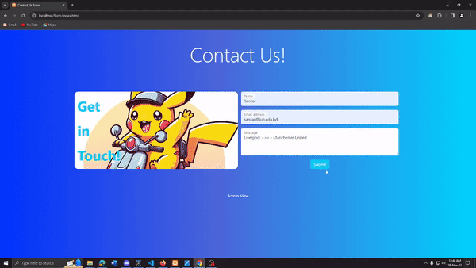
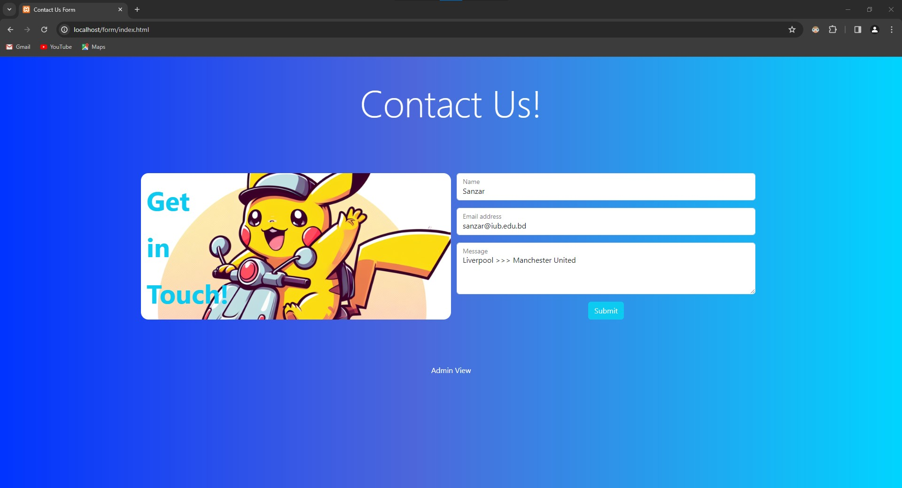
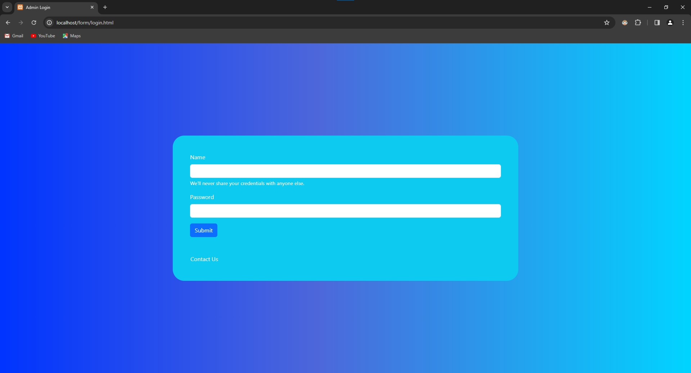
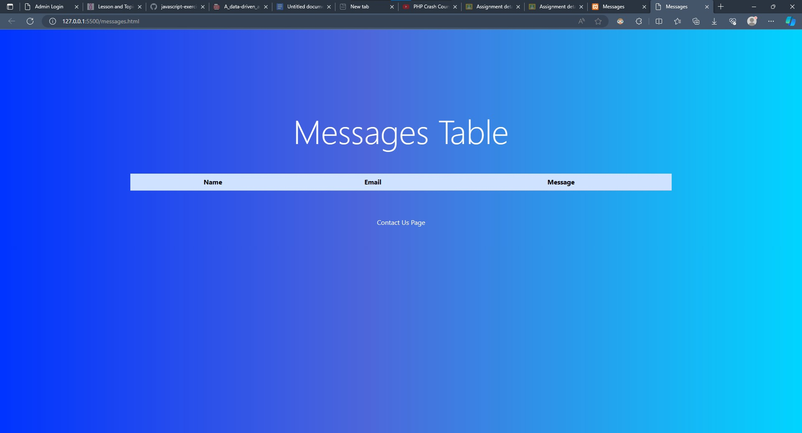
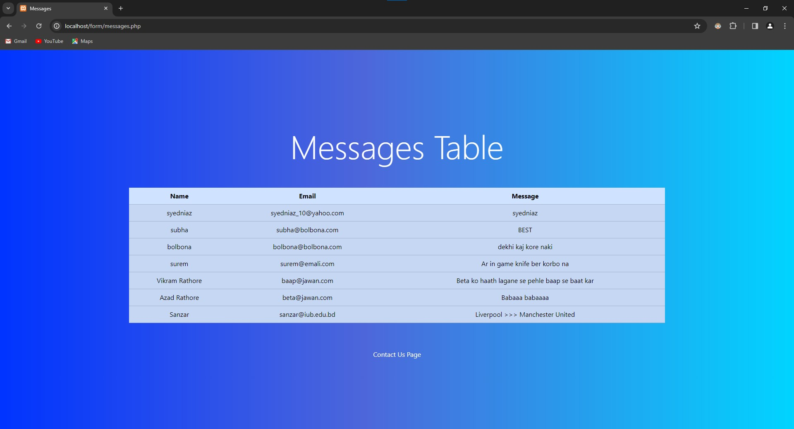
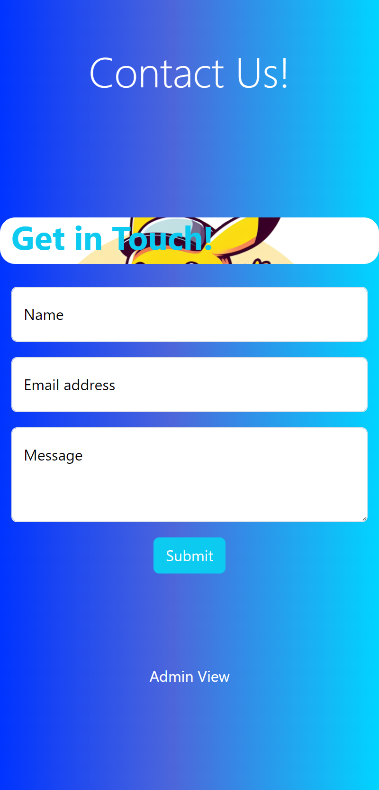
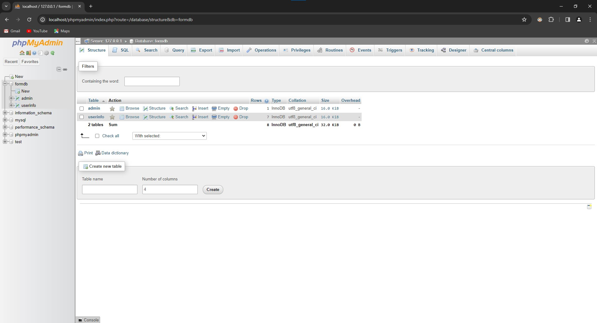
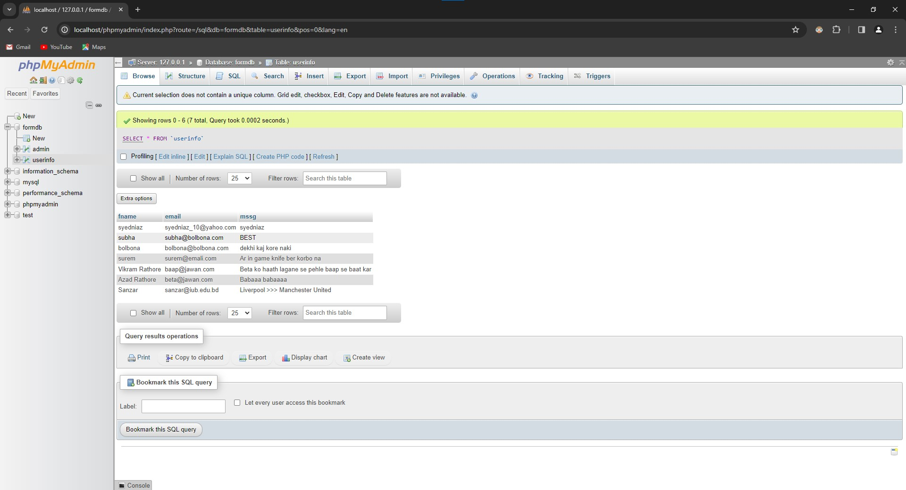

# contact-us-php
Contact-Us Page, Login Page and Messages Table Page built using HTML, CSS(Bootstrap 5). All pages are responsive.
This project was made for my Web Development Course (CSE309).

The pages are connected to the Backend using PHP and the database used here is MySQL. PHP and MySQL installed using XAMPP Server.
Message sent is on the contact us page. Admin can login from sign-in page and view the messages page, messages are shown in a table.

## More Screenshots

## Responsive Design

## Database View
 
## How to Run
Install XAMPP Go To htdocs folder inside c:\xampp clone the project inside htdocs directory open localhost Done!
